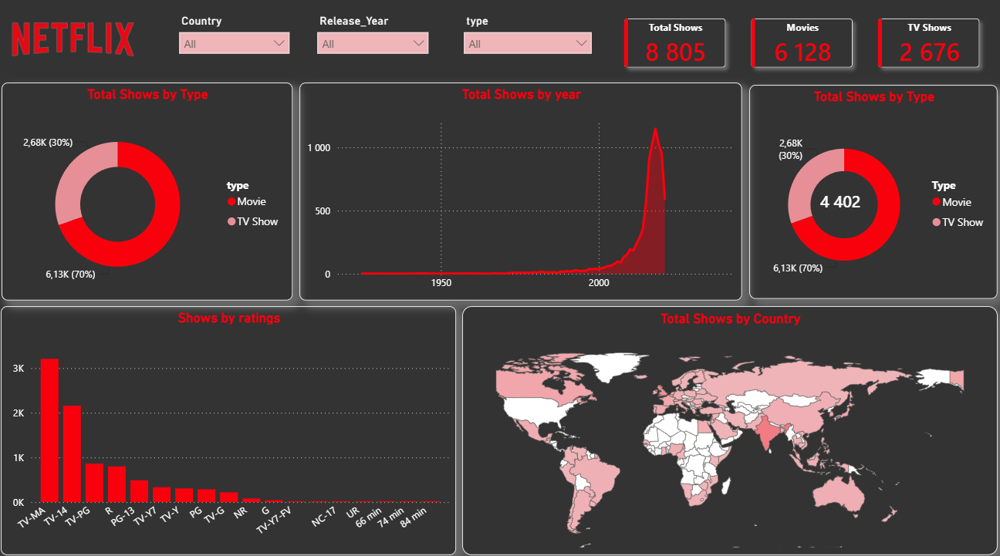

# 🎬 Netflix Dashboard – Analyse & Insights

## 📌 Contexte du projet

Ce projet propose un **dashboard interactif** construit à partir du catalogue Netflix (films et séries), permettant d'explorer la répartition du contenu par type, année de sortie, classification (rating) et pays de production.

Le dashboard intègre des filtres dynamiques (**Country**, **Release Year**, **Type**) permettant une exploration personnalisée des données.

---

## 📊 Aperçu des indicateurs clés (KPIs)

| Indicateur | Valeur |
|---|---|
| **Total Shows** | 8 805 |
| **Movies (Films)** | 6 128 |
| **TV Shows (Séries)** | 2 676 |

---

## 🔍 Insights principaux

### 1. Répartition Films vs Séries
- Les **films représentent environ 70 %** du catalogue (≈ 6,13K titres), contre **30 % pour les séries** (≈ 2,68K titres).
- Netflix a historiquement misé davantage sur les longs métrages, même si l'offre de séries reste substantielle.

### 2. Évolution du contenu par année
- Le nombre de contenus ajoutés reste **quasiment nul avant les années 2000**.
- On observe une **croissance exponentielle à partir des années 2010**, avec un **pic très marqué autour de 2018-2019**.
- Cette tendance illustre la stratégie d'expansion massive de contenu menée par Netflix durant la dernière décennie, avant un léger recul (probablement lié à un ralentissement des acquisitions ou à des données incomplètes pour les années les plus récentes).

### 3. Classification des contenus (Ratings)
- **TV-MA** (contenu réservé aux adultes) est de loin la classification la plus représentée, suivie de **TV-14** et **TV-PG**.
- Les classifications destinées à un jeune public (**TV-Y, TV-G, G, TV-Y7-FV**) sont très minoritaires.
- Cela confirme le positionnement de Netflix comme plateforme orientée vers un **public adulte et adolescent**, plus que vers le contenu familial/enfant.

### 4. Répartition géographique
- La carte met en évidence une **forte concentration de production aux États-Unis et en Inde**, deux marchés historiquement clés pour Netflix.
- Le reste du contenu est réparti de manière plus modérée à travers l'Europe, l'Amérique du Sud et l'Asie, traduisant la stratégie d'**internationalisation du catalogue**.
- Certains pays (en blanc sur la carte) n'ont aucun contenu recensé dans le dataset.

---

## 🧠 Conclusions

- Netflix a construit un catalogue **majoritairement composé de films**, avec une accélération très nette de la production/acquisition de contenu à partir de 2015.
- La plateforme cible en priorité un **public adulte**, comme le montre la dominance des classifications TV-MA et TV-14.
- La stratégie de contenu reste **fortement centrée sur les États-Unis et l'Inde**, tout en couvrant un grand nombre de pays à moindre échelle, ce qui reflète une volonté d'expansion mondiale.

---

## 🛠️ Outils utilisés
- Visualisation : *(Power BI / DAX/ PowerQuery)*
- Source de données : Netflix Titles Dataset

---
